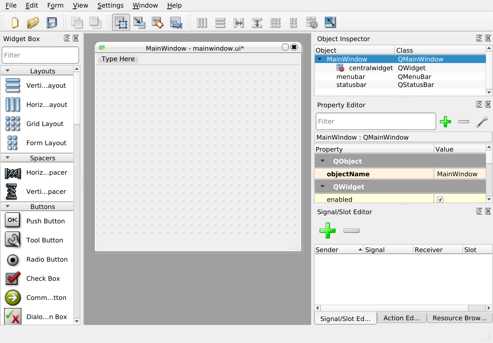
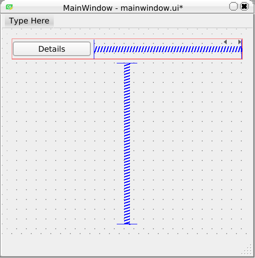

# Using Signals and Slots and  Cpp, Qt, ui and cmake project

[cpp-qt-ui-cmake](https://github.com/aoloe/cpp-qt-ui-cmake) teaches how to create a sample Qt app that does nothing.

The goal of this tutorial is to teach you how to react to events by using the Qt signal and slots system.

Before you start you should get the final files from [cpp-qt-ui-cmake](https://github.com/aoloe/cpp-qt-ui-cmake).

We will create a window with multiple pages that are shown one at a time, at the full size of the window.

## Using Qt Designer

- On the left you see the Widget Box: you can drag the Widgets into the Main Window.
- In the middle, the preview of the Main Window.
- On the right side, the Object Inspector lists all the widgets and layouts in the current Window.
- In the lower part of the right side, the Property Editor, allows to edit the properties of the Widget currently selected.

## Adding widgets to the `.ui` file

Open `ui/mainwindow.ui` in Qt Designer.

Drop a StackedWidget in the _middle_ of the Main Window.

A stacked widget shows one of multiple pages.

Right click on the background of the Main Window and in the _Lay out_ sub menu pick _Layout in a Grid_: now the Stacked Widget should be of the same size as the window.

There are two small arrows in the top right corner of the Widget: you can use them to switch between the existing pages.

By default you will have two pages: `page` and `page_2`. Click on each of them in the Object Inspector, and use the Property Editor to set the _objectName_ to `list` for the first to `details` for the second one.

On each page:

- From the Widget Box, drop an "Horizontal Layout" in the middle of the page.
- With a right click on the page background of the page choose "Layout Vertically".
- From the Widget Box drop a "Push Button" in the middle of the horizontal layout.
- Add an "Horiztonal Spacer" element at the right of the Button to push it to the left (mind where the blue line is).
- Add a "Vertical Spacer" element below the "Horizontal layout" to push it to the top.

If you have issue, dropping the widgets, layouts or spacer to the right place, you can drop them into the Object Inspector.

In the Property Editor:

- In the list page, set the button's Text property to "Details".
- In the details page, set the button's Text property to "List" .

Then set the `objectName` of the buttons to `detailsPushButton` and `listPushButton`.

We will use the buttons to move back and forth between the pages.  
In Designer you will need to use the small arrows in the top right corner of the StackedWidget (or the Object Inspector), since the buttons are not _active_.

The result should look like this:

